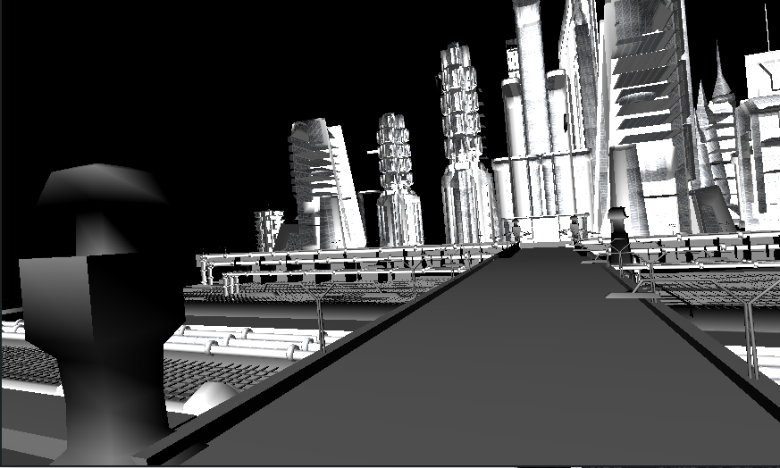
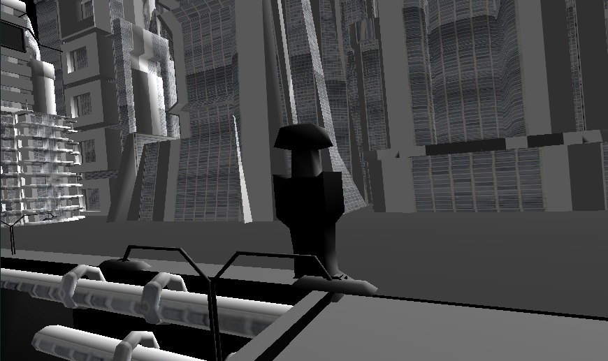

# Projeto Mondoj

  Esse projeto se trata de um jogo para desktop, android e ios, usando a 
biblioteca [libGDX](https://libgdx.badlogicgames.com)

## Como usar?
  Baixe um release para desktop

## Authors

* **Gilberto Ramos de Oliveira** - * Programador Java*

## Bibliotecas

*  [libGDX](https://libgdx.badlogicgames.com)- Biblioteca grafica para Desktop e Android

"O inimigo se escondera no ultimo lugar aonde vocé o procuraria."
Júlio César 75 a.C.
